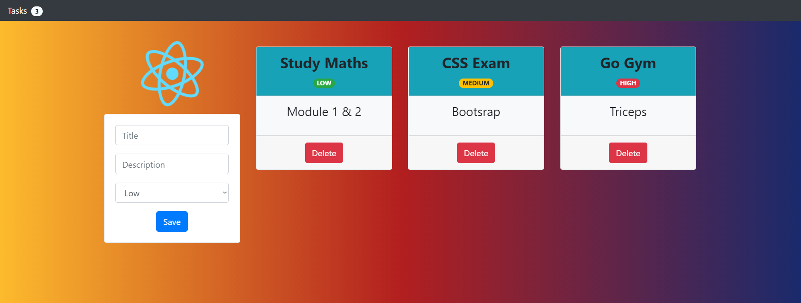

# 💻Tasks Management App 

My first React project 😍!

## Run the following scripts

This project was bootstrapped with [Create React App](https://github.com/facebook/create-react-app).

### `npm install` or `yarn install`

Installs project dependencies located in the package.json.

### `npm start` or `yarn start`

Runs the app in the development mode. 
Open [http://localhost:3000](http://localhost:3000) to view it in the browser.

## Oh, thanks!
If you'd like to [say thanks](https://saythanks.io/to/JoacoViera) :) 

Thanks to [uiGradients](https://uigradients.com) for the awesome background !