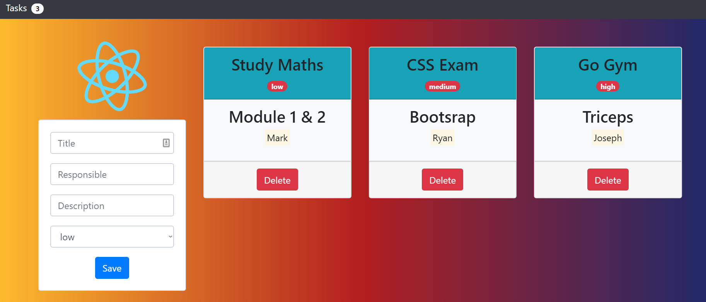

# 💻Tasks Management App  

My first React project 😍!

It contains some bugs, like add new empty tasks and duplicated for example.

## How to run the project ?

This project was bootstrapped with [Create React App](https://github.com/facebook/create-react-app).

First run the following command to install all node modules.

### `npm install`

Then just write this in your command prompt to run the project in your localhost on port 3000:

### `npm start`

## Oh, thanks!
If you'd like to [say thanks](https://saythanks.io/to/JoacoViera) :) 

Thanks to [uiGradients](https://uigradients.com) for the awesome background !